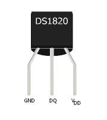
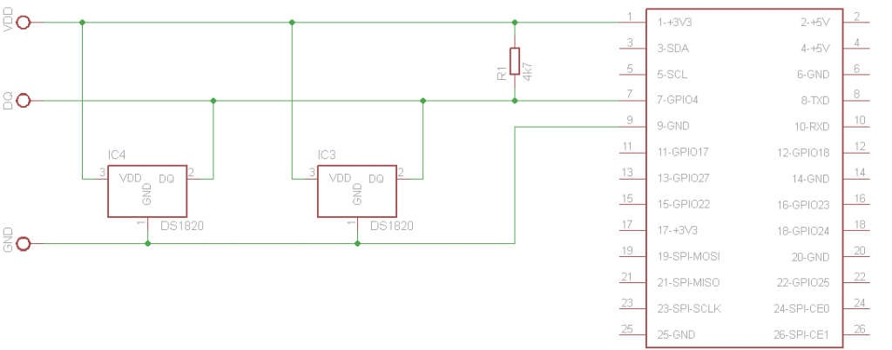
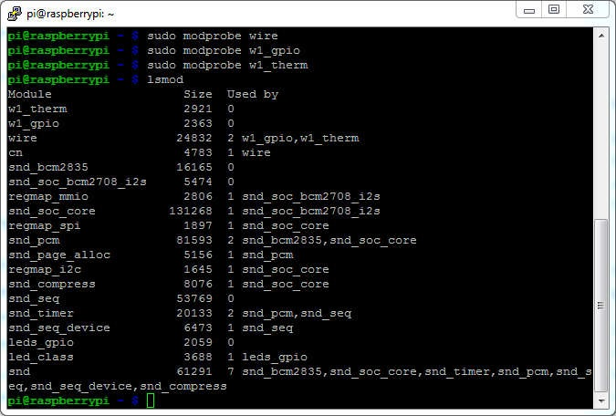
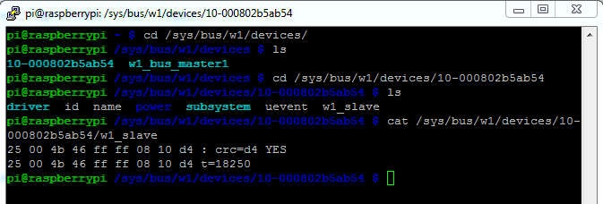

# 1-Wire-Temperature-Sensor -> Raspberry Pi

## Sensor

### DS1820



  - Pin 1: GND
  - Pin 2: DQ
  - Pin 3: VDD
  
### Folder

Each sensor will have its own folder under /sys/bus/w1/devices

In each sensor folder will be one file called w1_slave, needed to read data out of sensor (Software/Read)

### Setup



## Software

- OS on Raspberry: Raspbian

- load needed modules:

```
sudo modprobe wire
sudo modprobe w1_gpio
sudo modprobe w1_therm

```

- check if loading of modules was successful, with:

```
lsmod

```

Result of command should be:



### Automatic startup of commands

Open file /etc/modules

```
sudo nano /etc/modules

```

Add following lines to the file and save:

```
wire
w1-gpio
w1-therm

```

### Read

#### Command line

Change the directory to one connected sensor, each with id 10-000802b5ab54

```
cd /sys/bus/w1/devices/
ls
cd /sys/bus/w1/devices/10-000802b5ab54
ls
cat /sys/bus/w1/devices/10-000802b5ab54/w1_slave

```

The displayed result should be:



Where t=18250 displays the temperature. Divide it by 1000 and you have the temperature in °C.  In this example it would be 18.25°C.

#### PHP

To read out the current temperature using PHP, use following code:

```
<?php
   $temp = exec('cat /sys/bus/w1/devices/10-000802b5ab54/w1_slave |grep t=');
   $temp = explode('t=',$temp);
   $temp = $temp[1] / 1000;
   $temp = round($temp,2);
   
   echo $temp . " &#x00B0;C";

?>

```

