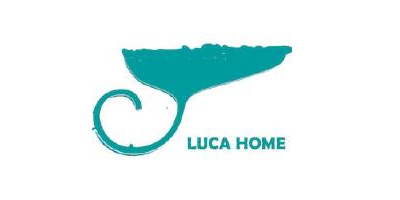

<div align="center">
	
</div>

# LucaHome

[](https://opensource.org/licenses/MIT)
[](https://www.paypal.me/GuepardoApps)
[](http://makeapullrequest.com)

Projects for home automation and other stuff integrated into nextcloud environment.

## Existing implementations

These projects are already implemented.

### WirelessControl

- [x] Control 433MHz sockets using a raspberry pi running nextcloud. [WirelessControl-Nextcloud](https://github.com/LucaHome/WirelessControl-Nextcloud)

- [x] Three clients exist

	- [x] The [Website](https://github.com/LucaHome/WirelessControl-Nextcloud/tree/master/src) itself, integrated in nextcloud, build with VueJs
[](https://vuejs.org/)
[](http://php.net/)
[](https://isocpp.org/)

	- [x] [Android client](https://github.com/LucaHome/WirelessControl-Android) build with Flutter & Dart
[](https://android-arsenal.com/api?level=16)
[](https://flutter.dev/)
[](https://kotlinlang.org/)

	- [x] [Desktop client](https://github.com/LucaHome/WirelessControl-Desktop) build with Electron & React using Typescript
[](https://www.typescriptlang.org/)
[](https://electronjs.org/)
[](https://reactjs.org/)

#### Screenshots


## Planned implementations

These projects are planned to be created.

### Passman - Desktop client

[Passman](https://github.com/nextcloud/passman) is an open source password manager with Nextcloud integration.
It has [Webextensions](https://github.com/nextcloud/passman-webextension) for Chrome & Firefox and its own [Android application](https://github.com/nextcloud/passman-android).

Goal is to implement a desktop client with the same architecture like [WirelessControl](https://github.com/LucaHome/WirelessControl-Desktop).

### Temperature Logging

- [ ] requires .db for storing data
- [ ] Nextcloud integration to call db-data and send warnings via mail using TimedJobs or push by active connection
- [x] will be [PYTHON](https://github.com/LucaHome/LucaHome-RaspberryTemperatureLogger) script & PHP, JS/TS

### PuckJs Beacons Logging ???

- [ ] requires .db for storing codes and data (Temperature, Light, Magnetic field, ...)
- [ ] library to connect via Bluetooth
- [ ] send warnings via mail or push by active connection
- [ ] Server & client

### SmartPhone Navigation

- [ ] requires PuckJs Beacon connection
- [ ] will be implemented only for mobile clients => Kotlin or Dart

### Network Control

- [ ] library to monitor network
- [ ] send warnings via mail or push by active connection
- [ ] Server & client
- [ ] Technology? C++/C#/Go?

### Camera Monitoring with Motion Detection

- [ ] library for camera & motion detection
- [ ] send warnings via mail or push by active connection
- [ ] Server & client
- [ ] Technology? C++/C#/Go?

### Further ideas

- Shared Meal planning
- Shared ShoppingList
- WakeUp with alarm (music playing) and light increasing ([old project](https://github.com/LucaHome/LucaHome-MediaServer))

## License

LucaHome is distributed under the MIT license. [See LICENSE](LICENSE.md) for details.

```
MIT License

Copyright (c) 2016-2019 GuepardoApps (Jonas Schubert)

Permission is hereby granted, free of charge, to any person obtaining a copy
of this software and associated documentation files (the "Software"), to deal
in the Software without restriction, including without limitation the rights
to use, copy, modify, merge, publish, distribute, sublicense, and/or sell
copies of the Software, and to permit persons to whom the Software is
furnished to do so, subject to the following conditions:

The above copyright notice and this permission notice shall be included in all
copies or substantial portions of the Software.

THE SOFTWARE IS PROVIDED "AS IS", WITHOUT WARRANTY OF ANY KIND, EXPRESS OR
IMPLIED, INCLUDING BUT NOT LIMITED TO THE WARRANTIES OF MERCHANTABILITY,
FITNESS FOR A PARTICULAR PURPOSE AND NONINFRINGEMENT. IN NO EVENT SHALL THE
AUTHORS OR COPYRIGHT HOLDERS BE LIABLE FOR ANY CLAIM, DAMAGES OR OTHER
LIABILITY, WHETHER IN AN ACTION OF CONTRACT, TORT OR OTHERWISE, ARISING FROM,
OUT OF OR IN CONNECTION WITH THE SOFTWARE OR THE USE OR OTHER DEALINGS IN THE
SOFTWARE.

```